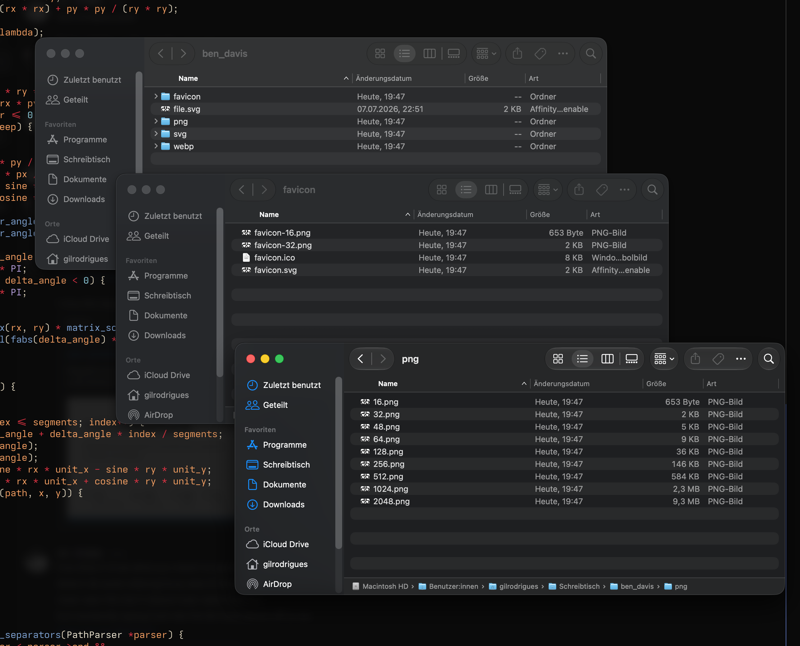

# archetypon

SVG parsing and rasterization, PNG encoding, lossless WebP encoding, ICO assembly, and conservative SVG optimization without third-party runtime libraries or subprocesses.



### Install

```sh
git clone https://github.com/gildrb/archetypon
cd archetypon
make
sudo make install
```

### Use

```sh
cd /path/to/file
archetypon create file.svg
```

`create` reads one SVG and writes `svg/`, `png/`, `webp/`, and `favicon/` in the current directory. Numeric filenames identify the longest edge. The other edge is derived from the SVG `viewBox`; aspect ratio is preserved and square padding is never added.

### Commands

| Command | Purpose |
| --- | --- |
| `make` | Compile `main.c` into `archetypon` with the system C compiler and `libm` |
| `sudo make install` | Install `archetypon` under `${PREFIX:-/usr/local}/bin` |
| `archetypon create <file.svg>` | Validate the input and generate the complete asset tree in the current directory |
| `archetypon --help` | Print the accepted command syntax |
| `make test` | Build and run the output, preservation, rejection, and decoder checks |
| `make clean` | Remove the local `archetypon` executable |

Build variables are conventional Make inputs:

```sh
make CC=clang CFLAGS='-std=c11 -O2 -Wall -Wextra -Wpedantic'
make install PREFIX="$HOME/.local"
```

### Files

```text
archetypon.c/
  assets/
    archetypon-output.png  generated asset-tree screenshot
  main.c             CLI, SVG parser, rasterizer, resizer, encoders, filesystem writes
  Makefile           build, install, test, clean
  README.md          commands, files, dataflow, input/output contract, verification
  tests/test.sh      end-to-end fixture and format checks
  .gitignore         generated executable and asset directories
```

`main.c` owns the complete runtime. It links only the C runtime and `libm`

### Output

```text
<current directory>/
  <input.svg>                  caller-owned source; never modified
  svg/
    original.svg              byte-for-byte input copy
    optimized.svg             comments and inter-element whitespace removed
  png/
    16.png
    32.png
    48.png
    64.png
    128.png
    256.png
    512.png
    1024.png
    2048.png
  webp/
    256.webp
    512.webp
    1024.webp
  favicon/
    favicon.svg               same bytes as svg/optimized.svg
    favicon.ico               embedded 16, 32, and 48 PNG payloads
    favicon-16.png            same bytes as png/16.png
    favicon-32.png            same bytes as png/32.png
```

For a `240 × 120` viewBox, `png/2048.png` is `2048 × 1024`, `png/16.png` is `16 × 8`, and the ICO entries are `16 × 8`, `32 × 16`, and `48 × 24`. Names describe the requested longest edge, not a square canvas.

Existing files at owned output paths are replaced. Unrelated files in those directories are not removed. Input parsing and the 2048-edge master render complete before output directories are created; a later filesystem failure can leave a partially updated output tree.

### Dataflow

```text
<input.svg>
     |
     +--> read: maximum 32 MiB
     |
     +--> root geometry: viewBox, otherwise positive width + height
     |
     +--> XML/tag parser
     |      -> inherited presentation state
     |      -> affine transforms
     |      -> paths and primitive shapes
     |
     +--> path flattening
     |      -> cubic and quadratic subdivision
     |      -> elliptical-arc sampling
     |
     +--> 2x supersampled RGBA raster
     |      -> proportional 2048-edge master
     |
     +--> bilinear premultiplied-alpha resize
     |      +--> PNG: 16..2048
     |      +--> lossless VP8L WebP: 256, 512, 1024
     |      +--> PNG-backed ICO: 16, 32, 48
     |
     +--> conservative XML copy optimization
            +--> svg/optimized.svg
            +--> favicon/favicon.svg
```

Raster generation scales and centers the declared viewBox into an output whose dimensions already match that aspect ratio. It does not stretch, crop, or add a square background.

### SVG contract

Supported geometry:

| Surface | Accepted input |
| --- | --- |
| Root | one non-nested `svg`; positive `viewBox` or unitless/`px` width and height |
| Containers | `g`, `a`, `defs`, `metadata`, `title`, `desc`; editor-namespaced metadata is ignored |
| Shapes | `path`, `rect`, `circle`, `ellipse`, `line`, `polyline`, `polygon` |
| Path data | absolute and relative `M L H V C S Q T A Z`, repeated parameters, multiple contours |
| Transforms | `matrix`, `translate`, `scale`, `rotate`, `skewX`, `skewY` |
| Paint | solid fill/stroke, `none`, `transparent`, `currentColor`, hexadecimal colors, numeric `rgb()`/`rgba()`, basic SVG color names |
| Compositing | element, fill, and stroke opacity; `nonzero` and `evenodd` fill rules |
| Stroke | width plus butt, round, and square cap syntax; solid strokes only |
| Rectangle | optional `x`, `y`, `rx`, `ry`; radii clamped to half-size |

Intentional boundaries:

| Rejected surface | Reason |
| --- | --- |
| gradients and paint servers | no gradient sampler or referenced paint graph |
| text and `tspan` | no font parser, shaping, or glyph rasterizer |
| `image`, `use`, `foreignObject` | no external resource or document resolver |
| CSS stylesheets | no selector or cascade engine; presentation attributes and inline declarations only |
| filters, masks, clipping paths, patterns | no offscreen effect graph |
| dashed strokes | no dash subdivision |
| nested SVG viewports | one root coordinate system only |
| percentage and non-pixel dimensions | no CSS unit-resolution context |

Unsupported rendering elements and recognized unsupported paint/effect properties terminate the command with a nonzero exit status. Editor metadata and unknown CSS declarations that do not define geometry are ignored.

Opacity on a container is multiplied into descendants; containers are not composited through separate offscreen layers. Stroke geometry uses the renderer's minimal distance-based rasterizer. These are implementation boundaries, not claims of full SVG conformance.

### Encoders

| Format | Contract |
| --- | --- |
| PNG | RGBA, 8 bits per channel, non-interlaced, filter type 0, zlib stored DEFLATE blocks, CRC-32 and Adler-32 generated locally |
| WebP | RIFF `WEBP` container, lossless `VP8L`, literal ARGB channels, canonical fixed prefix codes, no color cache, transforms, or backward references |
| ICO | icon directory with three PNG-backed entries; directory dimensions match each proportional PNG payload |
| optimized SVG | source bytes preserved except XML comments, whitespace between elements, trailing whitespace, and one normalized final newline |

The encoders prioritize a small auditable implementation over compression ratio. PNG and WebP outputs are valid but intentionally do not implement adaptive compression.

### Exit contract

| Status | Meaning |
| --- | --- |
| `0` | help printed or all requested assets written |
| `1` | invalid/unsupported SVG, allocation failure, or filesystem/encoding failure |
| `2` | unsupported command or argument count |

Diagnostics are written as `archetypon: <cause>` to standard error. Usage errors print accepted syntax to standard error. Successful generation prints one line to standard output.

### Verification

```sh
cd "$HOME/Repos/archetypon.c"
make clean
make test

cc -std=c11 -O1 -g -fno-omit-frame-pointer \
  -fsanitize=address,undefined \
  -Wall -Wextra -Wpedantic \
  main.c -lm -o /tmp/archetypon-sanitize
```

`make test` requires ImageMagick's `identify` and `compare` commands. `tests/test.sh` verifies:

1. CLI output and exit statuses for help, usage errors, successful generation, and rejected inputs;
2. the exact output tree, replacement of owned files, preservation of unrelated files, source copying, and SVG optimization;
3. representative pixels from every supported shape type, fills, strokes, transforms, opacity, inline styles, and `currentColor`;
4. dimensions and decoder validity for every PNG, WebP, and ICO output, including lossless pixel equality between formats;
5. rejection diagnostics and the guarantee that invalid input creates no output directories.

### Safety

`create` owns and overwrites the paths listed under **Output**. Run it from the intended asset directory. It does not delete unrelated files, modify the input SVG, access the network, execute subprocesses, load external SVG resources, or write outside the current directory's fixed output subdirectories.
