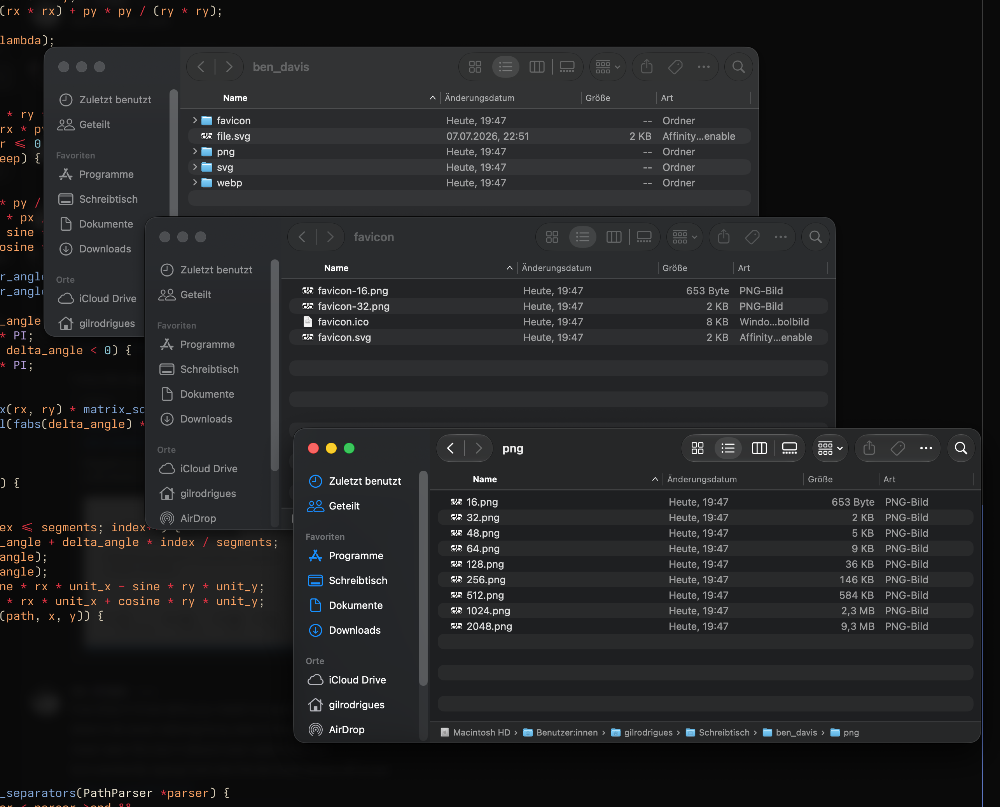

# archetypon

Generate optimized SVG, PNG, lossless WebP, and favicon assets from SVG.



### Install

```sh
git clone https://github.com/gildrb/archetypon
cd archetypon
make
sudo make install
```

### Use

```sh
archetypon create file.svg
archetypon create png file.svg
```

Omit the format to create all assets. Available formats are `svg`, `png`,
`webp`, and `ico`.

### Test

`make test` requires ImageMagick.

```sh
make test
```

### Supported SVG subset

The retained renderer supports paths and basic shapes, affine transforms, solid
and linear-gradient or radial-gradient fills, presentation attributes, inline styles, simple
embedded element/class/ID CSS selectors, dashed strokes with round/miter/bevel
joins, group and element opacity, clipping paths, and luminance or alpha masks.
Group effects are isolated and composited once. Gradient, CSS, scene, surface,
path, effect, and render-work limits bound untrusted input and temporary memory.

Unsupported constructs fail during document creation instead of rendering a
partial result. Current explicit limits include text, images, external
resources, filters, patterns, nested viewports, complex CSS selectors, nested
clip/mask references inside effect content, and non-pad gradient spread modes.

### Bounded radial gradients and effects

Radial fills require `gradientUnits="userSpaceOnUse"`, explicit absolute
`cx`, `cy`, and nonnegative `r`. Optional `fx` and `fy` default to the center.
A nonzero-radius gradient requires its focus strictly inside the outer circle.
`gradientTransform`, pad spread, and the existing gradient stops are supported.
A zero radius uses the last stop. Percentage radial coordinates,
object-bounding-box radial units, nonzero `fr`, and radial `href` inheritance
are rejected rather than approximated.

RGB paint accepts comma-separated RGB/RGBA and whitespace-separated RGB with
optional slash alpha. Components must be finite numbers in 0..255; alpha is
0..1. Percentage components and malformed or trailing input are rejected.

Clip/mask definitions and their paths grow dynamically within the shared
32 MiB compiled-scene budget and 100,000 XML-element limit. At most 25,000
clip/mask shapes are accepted across the document; there is no fixed array
per mask. Independent masks can be intersected by nested group applications.
References to further effects inside clip/mask content are rejected.
